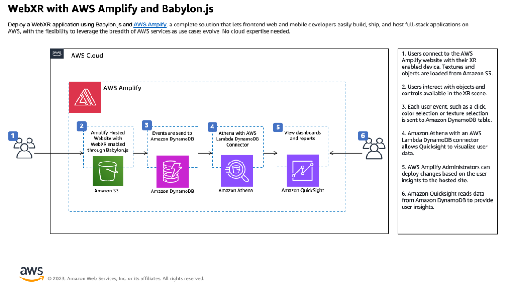
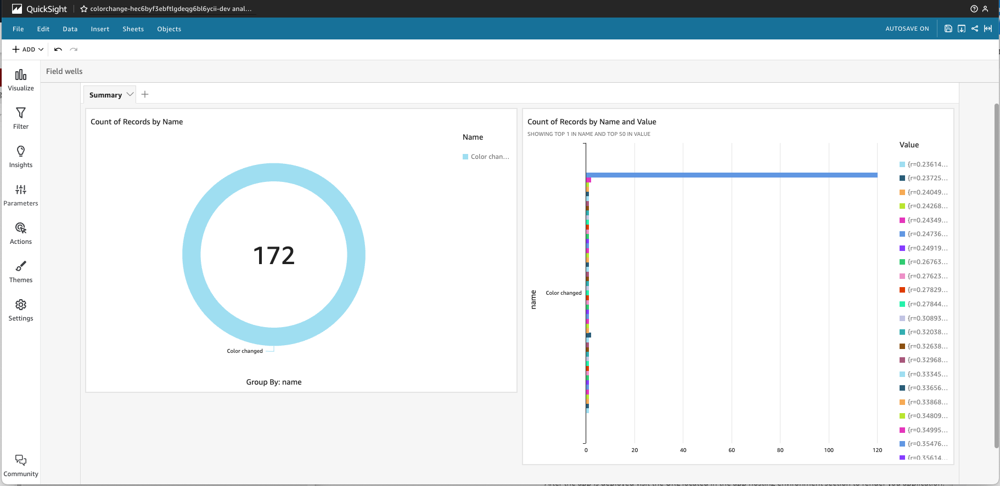

# Create a VR application with user insights using AWS Amplify and the WebXR stack


Learn how to create a virtual reality experience with user insights to improve your product using <a href="https://aws.amazon.com/amplify/">AWS Amplify</a> and <a href="https://doc.babylonjs.com/">Babylon.js</a>’s <a href="https://doc.babylonjs.com/divingDeeper/webXR/introToWebXR">WebXR</a> implementation. Using this combination of technologies is just one way to help reduce the barrier of getting your first Virtual Reality (VR) application up and running. 

This how-to will cover the steps to create a simple VR enabled application that uses AWS Amplify to host the full-stack application, Babylon.js’s WebXR implementation for VR scenes and functionality, and Amazon DynamoDB to store and report on user events. The application will be setup and deployed using Amplify and Bablyon.js, controller input data will be enabled using WebXR, and the user input events will be stored and reported on using DynamoDB, Amazon Athena, and Amazon Quicksight. 3D models used in the application will be stored using Amazon Simple Storage Service (Amazon S3). Amplify will use AWS CodeCommit for continuous deployment. 

The end product will be an VR application using a 3D model that will record and report on the user inputs to provide insights on how to improve the user experience. 


In the Amplify application, a VR controller selects a blue color from the Color GUI. The event of changing the color sends the color value to the database.


<br>
<br>
<br>




Users connect to the AWS Amplify website with their XR enabled device. Textures and objects are loaded from Amazon S3 into the website. Objects can be managed in S3 outside of AWS Amplify.  Users interact with objects and controls available in the XR scene and each user event, such as a click, color selection, or texture selection is sent to Amazon DynamoDB. Amazon Athena makes the data available for Quicksight to provide user insights. AWS Amplify Administrators can deploy changes based on the user insights to the hosted site.


# Prerequisites
* An existing Amazon Web Services (AWS) Account with full permissions to AWS Amplify, Amazon DynamoDB, Amazon S3, Amazon Athena, and Amazon Quicksight
*	Familiarity with <a href="https://opensource.com/tags/javascript">JavaScript</a> and Linux command-line 
*	<a href="https://nodejs.org">Node.js</a> v14.x or later
*	<a href="https://www.npmjs.com">npm</a> v6.14.4 or later
*	<a href="https://git-scm.com">git</a> v2.14.1 or later
*	Latest <a href="https://docs.amplify.aws/cli/start/install/#configure-the-amplify-cli">Amplify CLI</a>; version 10.6.2 and above required


# Step 1: Set Up React Application

We will begin by creating a [React app](https://docs.amplify.aws/start/q/integration/react/); using create-react-app. Enter the following command in the directory where you want to create your app. 


```bash
npx create-react-app aws-babylon-app
cd aws-babylon-app
```

The aws-babylon-app directory should look as follows:

```bash
aws-babylon-app 
.
├── README.md
├── node_modules
├── package-lock.json
├── package.json
├── public
└── src
```


# Step 2: Installing Amplify and Babylonjs

Open a terminal and run in the aws-babylon-app directory:
```bash
npm install aws-amplify @aws-amplify/cli @babylonjs/core @babylonjs/gui babylonjs-loaders
```

The React App and the necessary Amplify, BabylonJS, and modules have been installed in the working directory. 


To test the basic React App, run the following command:

```bash
npm start
```
This will start a development server where you can see output generated by your build at http://localhost:3000.

In the running command terminal, press ctrl + C to close the running app.


# Step 3: Initialize Backend with Amplify

For this project we will be using Amplify’s integration with AppSync, S3, Cognito, and CodePipeline to build and deploy our app and to provision the necessary AWS resources. To do this, we will use the Amplify CLI to initialize and edit our Amplify environment.  

To get started, make sure you are in the root directory of your React application “aws-babylon-app” and run:


```bash
amplify init
```

Sample Output
```bash
aws-babylon-app % amplify init
Note: It is recommended to run this command from the root of your app directory
? Enter a name for the project awsbabylonapp
The following configuration will be applied:

Project information
| Name: awsbabylonapp
| Environment: dev
| Default editor: Visual Studio Code
| App type: javascript
| Javascript framework: react
| Source Directory Path: src
| Distribution Directory Path: build
| Build Command: npm run-script build
| Start Command: npm run-script start

? Initialize the project with the above configuration? Yes
Using default provider  awscloudformation
? Select the authentication method you want to use: AWS profile

For more information on AWS Profiles, see:
https://docs.aws.amazon.com/cli/latest/userguide/cli-configure-profiles.html

? Please choose the profile you want to use default
Adding backend environment dev to AWS Amplify app: dfy1ft7g673ub

Deployment completed.
Deploying root stack awsbabylonapp [ ====================-------------------- ] 2/4
	amplify-awsbabylonapp-dev-123… AWS::CloudFormation::Stack     CREATE_IN_PROGRESS             Thu Jul 27 2023 12:38:11…     
	UnauthRole                     AWS::IAM::Role                 CREATE_COMPLETE                Thu Jul 27 2023 12:38:28…     
	AuthRole                       AWS::IAM::Role                 CREATE_COMPLETE                Thu Jul 27 2023 12:38:28…     
	DeploymentBucket               AWS::S3::Bucket                CREATE_IN_PROGRESS             Thu Jul 27 2023 12:38:13…     

✔ Help improve Amplify CLI by sharing non sensitive configurations on failures (y/N) · no
Deployment state saved successfully.
✔ Initialized provider successfully.
✅ Initialized your environment successfully.

Your project has been successfully initialized and connected to the cloud!

```

 
 

Use the above configurations to create your Amplify environment. When prompted to choose a profile, select the one that you added when you configured the Amplify CLI in the prerequisites. 

When you initialize a new Amplify project, a few things happen:

* It creates a top level directory called `amplify` that stores your backend definition. During the tutorial you'll add cloud capabilities, such as GraphQL API and web hosting. As you add these features, the `amplify` folder will grow with infrastructure-as-code templates that define your backend stack. Infrastructure-as-code is a best practice way to create a replicable backend stack.
* It creates a file called `aws-exports.js` in the `src` directory that holds all the configuration for the services you create with Amplify. This is how the Amplify JavaScript client library is able to get the necessary information to connect to your backend services.
* It modifies the `.gitignore` file, adding some generated files to the ignore list
* An Amplify project is created for you that can be accessed within the AWS Console by running `amplify console`. The AWS Amplify console provides a list of backend environments, deep links to provisioned resources per Amplify category, deployment statuses, and instructions on how to promote, clone, pull, and delete backend resources.

“
https://docs.amplify.aws/start/getting-started/setup/q/integration/js/#initialize-a-new-backend


# Step 4: Create Backend Resources with Amplify

Run the following command and select each ensuing option as shown below. These commands will configure Storage powered by S3, Authentication powered by Cognito, and a GraphQL API powered by AppSync and DynamoDB for us.

## Authentication

```bash
amplify add auth
```
Select Default configuration, Email, and No, I am done when prompted.

Sample Output
```bash
Using service: Cognito, provided by: awscloudformation
 
 The current configured provider is Amazon Cognito. 
 
 Do you want to use the default authentication and security configuration? Default configuration
 Warning: you will not be able to edit these selections. 
 How do you want users to be able to sign in? Email
 Do you want to configure advanced settings? No, I am done.
✅ Successfully added auth resource awsbabylonapp1f29194e locally
```


## Storage

```bash
amplify add storage
```
Select Content (Images, audio, video, etc.), select default or your own name for the project, select default or your own S3 bucket, Auth and guest users for access, create/update for Authenticated users, read for Guest users, and no for Lambda Trigger.


Sample Output
```bash
? Select from one of the below mentioned services: Content (Images, audio, video, etc.)
✔ Provide a friendly name for your resource that will be used to label this category in the project: · s34ebxxxxx
✔ Provide bucket name: · awsbabylonappc01a935db3134ffcaxxxxxxxxxxxx
✔ Who should have access: · Auth and guest users
✔ What kind of access do you want for Authenticated users? · create/update
✔ What kind of access do you want for Guest users? · read
✔ Do you want to add a Lambda Trigger for your S3 Bucket? (y/N) · no
⚠️ Specified resource configuration requires Cognito Identity Provider unauthenticated access but it is not enabled.
✅ Successfully updated auth resource locally.
✅ Successfully added resource s34eb6ca45 locally
```


## GraphQL API

```bash
amplify add api
```

Select GraphQL, Continue, and Single object with fields.

Sample Output
```
? Select from one of the below mentioned services: GraphQL
? Here is the GraphQL API that we will create. Select a setting to edit or continue Continue
? Choose a schema template: Single object with fields (e.g., “Todo” with ID, name, description)

 
✅ GraphQL schema compiled successfully.

Edit your schema at /path-to-directory/aws-babylon-app/amplify/backend/api/awsbabylonapp/schema.graphql or place .graphql files in a directory at /path-to-directory/aws-babylon-app/amplify/backend/api/awsbabylonapp/schema
✔ Do you want to edit the schema now? (Y/n) · no
✅ Successfully added resource awsbabylonapp locally
```


Above we have added an S3 bucket to our project in order to be able to store a texture that we will upload later. In order to add Storage to an Amplify app Authentication is required to be enabled, so we have added that as well. Last we created a new GraphQL API powered by AppSync and backed by DynamoDB.

In order to make use of our API we should edit the data schema. Go to amplify/backend/api/api-name/schema.graphql and replace the existing models with the following:

```bash
type ColorChange @model {
  id: ID!
  name: String!
  value: String
}
```

And make sure to save. Here we create.... [Describe DynamoDB table and schema that is getting used]

Once complete, run:

```bash
amplify push
```

to push our changes into the cloud. 

Answer 'yes' to all Y/n questions, choose javscript for code generation language target, accept default file name pattern, and the default maxium statement depth of 2.

Sample Output
```bash
⠹ Fetching updates to backend environment: dev from the cloud.
⚠️  WARNING: your GraphQL API currently allows public create, read, update, and delete access to all models via an API Key. To configure PRODUCTION-READY authorization rules, review: https://docs.amplify.aws/cli/graphql/authorization-rules

⠸ Fetching updates to backend environment: dev from the cloud.✅ GraphQL schema compiled successfully.

Edit your schema at /path-to-directory/aws-babylon-app/amplify/backend/api/awsbabylonapp/schema.graphql or place .graphql files in a directory at /path-to-directory/aws-babylon-app/amplify/backend/api/awsbabylonapp/schema
✔ Successfully pulled backend environment dev from the cloud.
⠙ Building resource api/awsbabylonapp
⚠️  WARNING: your GraphQL API currently allows public create, read, update, and delete access to all models via an API Key. To configure PRODUCTION-READY authorization rules, review: https://docs.amplify.aws/cli/graphql/authorization-rules

⠹ Building resource api/awsbabylonapp✅ GraphQL schema compiled successfully.

Edit your schema at /path-to-directory/aws-babylon-app/amplify/backend/api/awsbabylonapp/schema.graphql or place .graphql files in a directory at /path-to-directory/aws-babylon-app/amplify/backend/api/awsbabylonapp/schema

    Current Environment: dev
    
┌──────────┬───────────────────────┬───────────┬───────────────────┐
│ Category │ Resource name         │ Operation │ Provider plugin   │
├──────────┼───────────────────────┼───────────┼───────────────────┤
│ Auth     │ awsbabylonappxxxxxxxx │ Create    │ awscloudformation │
├──────────┼───────────────────────┼───────────┼───────────────────┤
│ Storage  │ s3xxxxxxxxx           │ Create    │ awscloudformation │
├──────────┼───────────────────────┼───────────┼───────────────────┤
│ Api      │ awsbabylonapp         │ Create    │ awscloudformation │
└──────────┴───────────────────────┴───────────┴───────────────────┘
✔ Are you sure you want to continue? (Y/n) · yes

⚠️  WARNING: your GraphQL API currently allows public create, read, update, and delete access to all models via an API Key. To configure PRODUCTION-READY authorization rules, review: https://docs.amplify.aws/cli/graphql/authorization-rules

✅ GraphQL schema compiled successfully.

Edit your schema at /path-to-directory/aws-babylon-app/amplify/backend/api/awsbabylonapp/schema.graphql or place .graphql files in a directory at /path-to-directory/aws-babylon-app/amplify/backend/api/awsbabylonapp/schema
⠙ Building resource api/awsbabylonapp
⚠️  WARNING: your GraphQL API currently allows public create, read, update, and delete access to all models via an API Key. To configure PRODUCTION-READY authorization rules, review: https://docs.amplify.aws/cli/graphql/authorization-rules

⠹ Building resource api/awsbabylonapp✅ GraphQL schema compiled successfully.

Edit your schema at /path-to-directory/aws-babylon-app/amplify/backend/api/awsbabylonapp/schema.graphql or place .graphql files in a directory at /path-to-directory/aws-babylon-app/amplify/backend/api/awsbabylonapp/schema
? Do you want to generate code for your newly created GraphQL API Yes
? Choose the code generation language target javascript
? Enter the file name pattern of graphql queries, mutations and subscriptions src/graphql/**/*.js
? Do you want to generate/update all possible GraphQL operations - queries, mutations and subscriptions Yes
? Enter maximum statement depth [increase from default if your schema is deeply nested] 2

Deployment completed.
Deploying root stack awsbabylonapp [ ==============================---------- ] 3/4
	amplify-awsbabylonapp-dev-123… AWS::CloudFormation::Stack     UPDATE_COMPLETE_CLEANUP_IN_PR… Thu Jul 27 2023 13:04:41…     
	apiawsbabylonapp               AWS::CloudFormation::Stack     CREATE_COMPLETE                Thu Jul 27 2023 13:04:40…     
	storages34xxxxxx              AWS::CloudFormation::Stack     CREATE_COMPLETE                Thu Jul 27 2023 13:03:52…     
	authawsbabylonapp1xxx      AWS::CloudFormation::Stack     CREATE_COMPLETE                Thu Jul 27 2023 13:04:23…     
Deployed auth awsbabylonapp1fxxxxxxe [ ======================================== ] 10/10
	UserPool                       AWS::Cognito::UserPool         CREATE_COMPLETE                Thu Jul 27 2023 13:03:11…     
	UserPoolClientWeb              AWS::Cognito::UserPoolClient   CREATE_COMPLETE                Thu Jul 27 2023 13:03:12…     
	UserPoolClient                 AWS::Cognito::UserPoolClient   CREATE_COMPLETE                Thu Jul 27 2023 13:03:13…     
	UserPoolClientRole             AWS::IAM::Role                 CREATE_COMPLETE                Thu Jul 27 2023 13:03:27…     
	UserPoolClientLambda           AWS::Lambda::Function          CREATE_COMPLETE                Thu Jul 27 2023 13:03:35…     
	UserPoolClientLambdaPolicy     AWS::IAM::Policy               CREATE_COMPLETE                Thu Jul 27 2023 13:03:50…     
	UserPoolClientLogPolicy        AWS::IAM::Policy               CREATE_COMPLETE                Thu Jul 27 2023 13:04:04…     
	UserPoolClientInputs           Custom::LambdaCallout          CREATE_COMPLETE                Thu Jul 27 2023 13:04:08…     
	IdentityPool                   AWS::Cognito::IdentityPool     CREATE_COMPLETE                Thu Jul 27 2023 13:04:11…     
	IdentityPoolRoleMap            AWS::Cognito::IdentityPoolRol… CREATE_IN_PROGRESS             Thu Jul 27 2023 13:04:11…     
Deployed storage sxxxxxx5 [ ======================================== ] 8/8
	S3Bucket                       AWS::S3::Bucket                CREATE_COMPLETE                Thu Jul 27 2023 13:03:30…     
	S3AuthPublicPolicy             AWS::IAM::Policy               CREATE_IN_PROGRESS             Thu Jul 27 2023 13:03:30…     
	S3AuthProtectedPolicy          AWS::IAM::Policy               CREATE_IN_PROGRESS             Thu Jul 27 2023 13:03:30…     
	S3GuestReadPolicy              AWS::IAM::Policy               CREATE_IN_PROGRESS             Thu Jul 27 2023 13:03:30…     
	S3AuthUploadPolicy             AWS::IAM::Policy               CREATE_IN_PROGRESS             Thu Jul 27 2023 13:03:30…     
	S3AuthPrivatePolicy            AWS::IAM::Policy               CREATE_IN_PROGRESS             Thu Jul 27 2023 13:03:30…     
	S3GuestPublicPolicy            AWS::IAM::Policy               CREATE_IN_PROGRESS             Thu Jul 27 2023 13:03:30…     
Deployed api awsbabylonapp [ ======================================== ] 6/6
	GraphQLAPI                     AWS::AppSync::GraphQLApi       CREATE_COMPLETE                Thu Jul 27 2023 13:03:11…     
	GraphQLAPITransformerSchema3C… AWS::AppSync::GraphQLSchema    CREATE_COMPLETE                Thu Jul 27 2023 13:03:24…     
	GraphQLAPIDefaultApiKey2xxxxx… AWS::AppSync::ApiKey           CREATE_COMPLETE                Thu Jul 27 2023 13:03:12…     
	GraphQLAPINONEDS95A13CF0       AWS::AppSync::DataSource       CREATE_COMPLETE                Thu Jul 27 2023 13:03:24…     
	ColorChange                    AWS::CloudFormation::Stack     CREATE_IN_PROGRESS             Thu Jul 27 2023 13:03:25…     

✔ Generated GraphQL operations successfully and saved at src/graphql
Deployment state saved successfully.

GraphQL endpoint: https://5gim3xxxxxxxxxxxxxxxxx.appsync-api.us-east-1.amazonaws.com/graphql
GraphQL API KEY: da2-xxxxxxxxxxxxxxxxxxxxxxxx

GraphQL transformer version: 2

Browserslist: caniuse-lite is outdated. Please run:
  npx update-browserslist-db@latest
  Why you should do it regularly: https://github.com/browserslist/update-db#readme


```


Congratulations! We have now provisioned AWS resources using the Amplify CLI! Next we will begin building our Babylon app. 

# Step 5: Upload texture to S3  

Now that we have pushed Amplify into the cloud, we can go to the AWS console and view the resources that were created. 

Navigate to the S3 console and look for the bucket that you created in the last step. Click on it.

In the top directory, make a folder called 'public' then enter the folder. Inside of this folder we can click 'Upload' and upload our texture [checkered-texture.png] into the bucket. This is now accessible in the code,


# Step 6: Create the Application Scene


Next up we will be adding the “Starter HTML Template” from the Babylon.js documentation (https://doc.babylonjs.com/setup/starterHTML) to our index.html file.


## index.js
Add thefollowing code and paste it into src/index.js:


```bash
import React from 'react';
import ReactDOM from 'react-dom/client';
import './index.css';
import App from './App';
import reportWebVitals from './reportWebVitals';
import { Amplify } from 'aws-amplify';
import awsExports from './aws-exports';
Amplify.configure(awsExports);

const root = ReactDOM.createRoot(document.getElementById('root'));
root.render(
  <React.StrictMode>
    <App />
  </React.StrictMode>
);

// If you want to start measuring performance in your app, pass a function
// to log results (for example: reportWebVitals(console.log))
// or send to an analytics endpoint. Learn more: https://bit.ly/CRA-vitals
reportWebVitals();
```
 
## App.js
See the comments starting with // in the code for an explanation of each section. 

Add the following code into src/App.js:

```bash
import React from "react";
import { FreeCamera, Vector3, HemisphericLight, MeshBuilder } from "@babylonjs/core";
import SceneComponent from "./Scene";
import "./App.css";
import * as BABYLON from "@babylonjs/core/Legacy/legacy";
import * as GUI from '@babylonjs/gui';
import 'babylonjs-loaders';

// Amplify Imports
import { API, Storage } from "aws-amplify";
import * as mutations from './graphql/mutations';

let box;
let sphere;

/*
  Will be called to use our GraphQL API to create a new 
  colorChange entry in the DynamoDB table
*/
async function createColorChange(color) {
  const colorChangeDetails = {
    name: 'Color changed',
    value: color
  };

  const newColorChange = await API.graphql({
    query: mutations.createColorChange,
    variables: { input: colorChangeDetails }
  });
}

const onSceneReady = async (scene) => {

  // This creates and positions a free camera (non-mesh)
  const camera = new FreeCamera("camera1", new Vector3(0, 5, -10), scene);

  // This targets the camera to scene origin
  camera.setTarget(Vector3.Zero());

  const canvas = scene.getEngine().getRenderingCanvas();

  // This attaches the camera to the canvas
  camera.attachControl(canvas, true);

  // This creates a light, aiming 0,1,0 - to the sky (non-mesh)
  const light = new HemisphericLight("light", new Vector3(0, 1, 0), scene);

  // Default intensity is 1. Lets dim the light a small amount
  light.intensity = 0.7;

  // This retrieves our texture that is being stored in S3 
  let texture = await Storage.get('CheckeredTexture.png', { validateObjectExistence: false });

  // Create your sphere and set its position
  sphere = BABYLON.MeshBuilder.CreateSphere("sphere1", { segments: 16, diameter: 2 }, scene);
  sphere.position.y = 1;
  const env = scene.createDefaultEnvironment();

  // We now create the rest of our scene
  var plane = BABYLON.Mesh.CreatePlane("plane", 1);
  plane.position = new BABYLON.Vector3(1.4, 1.5, 0.4)
  var advancedTexture = GUI.AdvancedDynamicTexture.CreateForMesh(plane);
  var panel = new GUI.StackPanel();
  advancedTexture.addControl(panel);
  var header = new GUI.TextBlock();
  header.text = "Color GUI";
  header.height = "200px";
  header.color = "white";
  header.textHorizontalAlignment = GUI.Control.HORIZONTAL_ALIGNMENT_CENTER;
  header.fontSize = "120"
  panel.addControl(header);

  // Create a color picker
  var picker = new GUI.ColorPicker();
  sphere.material = new BABYLON.StandardMaterial("sphere material", scene)
  picker.value = sphere.material.diffuseColor;
  picker.horizontalAlignment = GUI.Control.HORIZONTAL_ALIGNMENT_CENTER;
  picker.height = "800px";
  picker.width = "800px";
  // Here we set the texture of the sphere to our imported texture
  sphere.material.diffuseTexture = new BABYLON.Texture(
    texture,
    scene
  );
  // Change the color of the sphere when the picker is used 
  picker.onValueChangedObservable.add(function (value) {
    sphere.material.diffuseColor.copyFrom(value);
    createColorChange(value);
  });
  panel.addControl(picker);

  // Enable WebXR
  const xr = await scene.createDefaultXRExperienceAsync();

};

/**
 * Will run on every frame render.  We are spinning the box on y-axis.
 */
const onRender = (scene) => {

  if (box !== undefined) {
    const deltaTimeInMillis = scene.getEngine().getDeltaTime();

    const rpm = 10;
    box.rotation.y += (rpm / 60) * Math.PI * 2 * (deltaTimeInMillis / 1000);
  }
};

export default () => (
  <body>
    <div>
      <SceneComponent style={{ height: '100vh', width: '100vw' }} antialias onSceneReady={onSceneReady} onRender={onRender} id="my-canvas" />
    </div>
  </body>
);
```

## Scene.js
See the comments starting with // in the code for an explanation of each section. 

Add a new file and code in the src directory called Scene.js:

```bash
import { useEffect, useRef } from "react";
import { Engine, Scene } from "@babylonjs/core";
import 'babylonjs-loaders';
import { AssetsManager } from "@babylonjs/core";

export default ({ antialias, engineOptions, adaptToDeviceRatio, sceneOptions, onRender, onSceneReady, ...rest }) => {
  const reactCanvas = useRef(null);

  // set up basic engine and scene
  useEffect(() => {
    const { current: canvas } = reactCanvas;

    if (!canvas) return;

    const engine = new Engine(canvas, antialias, engineOptions, adaptToDeviceRatio);
    const scene = new Scene(engine, sceneOptions);

    if (scene.isReady()) {
      onSceneReady(scene);
    } else {
      scene.onReadyObservable.addOnce((scene) => onSceneReady(scene));
    }

    engine.runRenderLoop(() => {
      if (typeof onRender === "function") onRender(scene);
      scene.render();
    });

    const resize = () => {
      scene.getEngine().resize();
    };

    if (window) {
      window.addEventListener("resize", resize);
    }

    //let loader = new AssetsManager(scene) 
    //let loadBikeModel = loader.addMeshTask("avocado", "./assets/", "avocado.gltf", scene)

    return () => {
      scene.getEngine().dispose();

      if (window) {
        window.removeEventListener("resize", resize);
      }
    };
  }, [antialias, engineOptions, adaptToDeviceRatio, sceneOptions, onRender, onSceneReady]);


  return <canvas ref={reactCanvas} {...rest} />;
};
```
 

Now we can run our application and see the 3D Babylon scene in the web broswer! (localhost:3000)


```bash
npm start
```
 
# Step 7: Create Code Commit for git-based CI/CD deployments

To host our app we will be utilizing the AWS Amplify Hosting service along with AWS CodeCommit. Amplify Hosting is a fully managed CD/CD and hosting service and AWS CodeCommit is fully managed source control service, which will allow us to have git-based CI/CD deployments for our app. (https://docs.aws.amazon.com/amplify/latest/userguide/setting-up-GitHub-access.html)

We will start by initializing a new git repo in CodeCommit, then adding it into our current project. 

In the terminal, run the command:
```bash
aws codecommit create-repository --repository-name awsRepo --repository-description "My app repository"
```

A successful execution of this command should return a response of the metadata for the repo. Ensure that you copy and save the `"cloneUrlHttp"`for use in the next step.

Example of cloneUrlHTTP
```bash
https://git-codecommit.us-east-1.amazonaws.com/v1/repos/awsRepo
```

To ensure that we have the correct permissions to now add this new repo to your project, run the following:

```bash
git config --global credential.helper '!aws --profile [YOUR PROFILE] codecommit credential-helper $@'
```

```bash
git config --global credential.UseHttpPath true
```

Run these commands from the root of your project:
```bash
git init
```
```
git add .
```
```
git commit -m "First commit"
```
```
git remote add origin [YOUR HTTP URL]
```

Ex“ https://git-codecommit.us-east-1.amazonaws.com/v1/repos/awsRepo

You can now run:

```bash
git push origin master
```

to make your first push to your repo!


# Step 8: Connect Amplify to Code Commit for continuous deployment.

Follow the steps located at  https://docs.aws.amazon.com/amplify/latest/userguide/getting-started.html to setup the hosting solution. These steps will be performed in the  AWS console. 
 

* Head to the AWS Amplify page and select your app, then select “Hosting environments” 
* Select our Code Commit repository and Connect branch.
* Recently updated respositories dropdown, select awsRepo
* Environment dev
 
* For build settings Amplify hosting automatically detects the front end framework and associated build settings by inspecting the package.json in the repository. For IAM service role you can choose an existing service role or let Amplify create a new service role. On the next page save and deploy the app. 

After the app is deployed visit the URL located in the app hosting environment section to render you application. 

One can observe the clone, build, and deploy process in the Amplify service in the AWS console.

# Step 9: Create Amazon Athena and DynamoDB Connector
The Amazon Athena DynamoDB connector (https://docs.aws.amazon.com/athena/latest/ug/connectors-dynamodb.html enables Amazon Athena to communicate with DynamoDB so that you can query your tables with SQL. This will allow the use of QuickSight to visualize the event data ingested from the user actions in the Scene. 

# Step 10: Create a QuickSight Dashboard
Create a QuickSight Dashboard (https://quicksight.aws.amazon.com/sn/start) to gain insights from event data stored in DynamoDB. Amazon QuickSight is a cloud-scale business intelligence (BI) service that you can use to deliver easy-to-understand insights. 

# Step 11: View and use the VR Application 
After the app is deployed visit the Production branch URL located in the app hosting environment section to render you application.
 
# Step 12: View Quicksight Dashboard
The QuickSight shows 172 VR controller clicks and the RGB value of the colors of each click.

<br>
 



# Step 13: Restrict Public Access or Clean up
To keep control of costs, either use <a href="https://docs.aws.amazon.com/amplify/latest/userguide/access-control.html">Restricting access to branches</a> instructions to password protect the Amplify URL or delete all of the created resources.


 